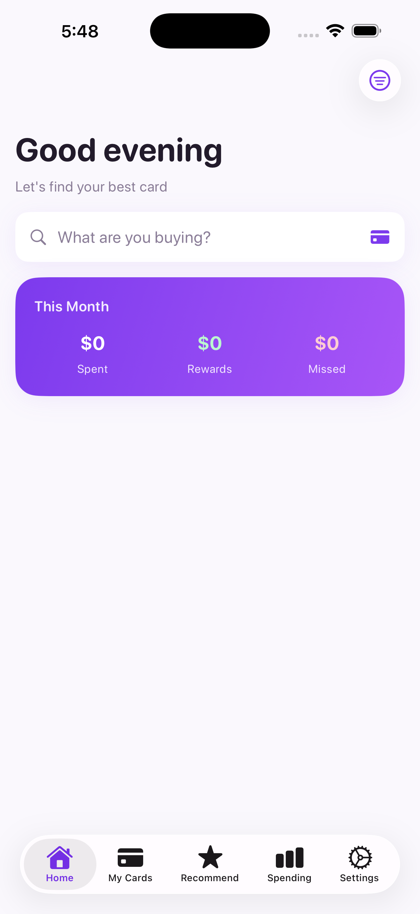
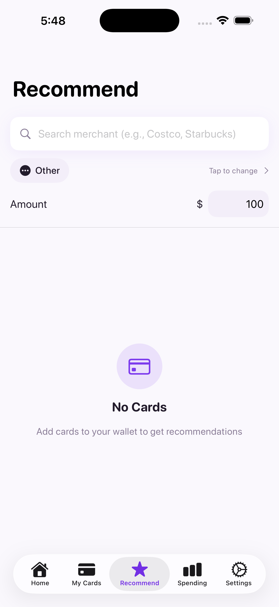
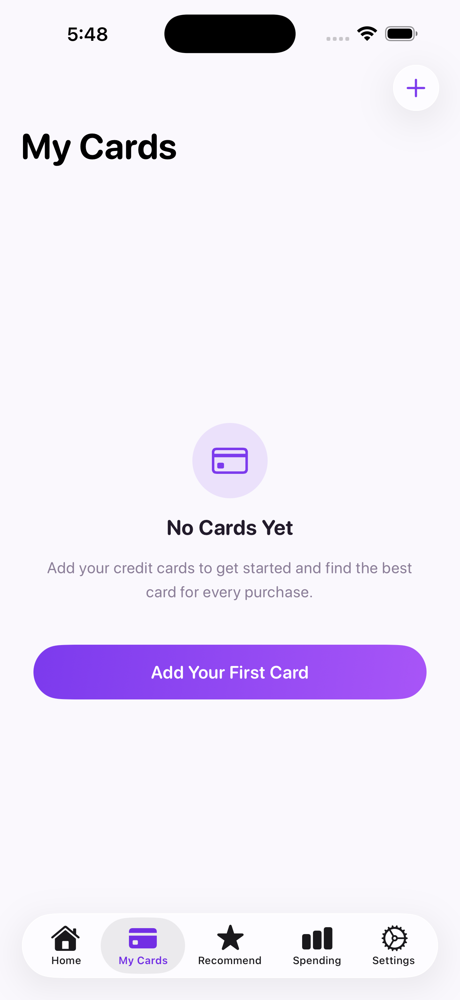
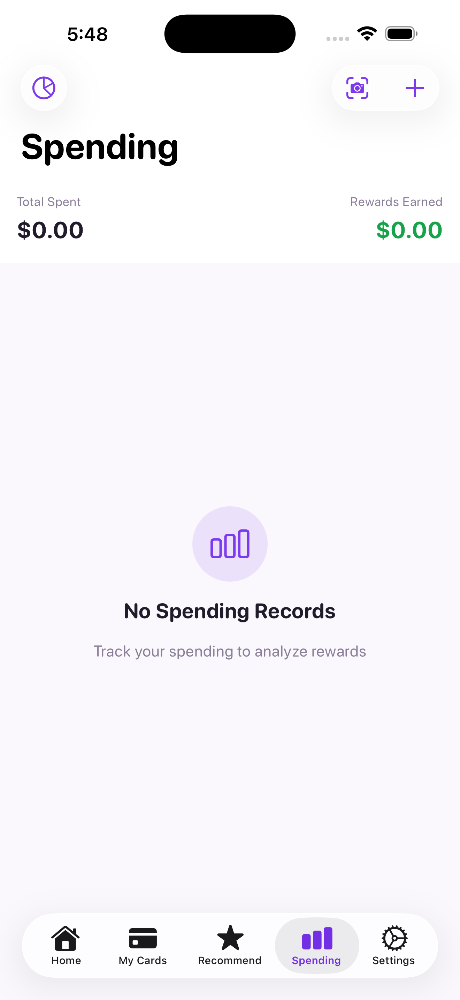

# CardWise

> Maximize your credit card rewards with smart recommendations.

An iOS app that helps you choose the best credit card for every purchase, so you never miss out on rewards.

[](https://swift.org/)
[](https://developer.apple.com/ios/)
[](../LICENSE)
[](../COMMERCIAL_LICENSE.md)

---

## Screenshots

<p align="center">
  
  
  
  
</p>

---

## Features

| Feature | Description |
|---------|-------------|
| **Smart Recommendations** | Get the best card suggestion based on merchant or category |
| **60+ Credit Cards** | Comprehensive database of major US credit cards with accurate reward data |
| **Reward Tracking** | Track fixed, rotating, and selectable category bonuses |
| **Spending Analytics** | Visualize spending patterns with interactive charts |
| **Receipt Scanning** | OCR-powered receipt scanning for quick expense logging |
| **Sign-Up Bonus Tracker** | Never miss a sign-up bonus deadline |
| **Home Screen Widget** | Quick access to recommendations without opening the app |
| **Privacy First** | All data stays on-device and syncs through your own iCloud — no accounts, no backend |

### Supported Cards

**60+ cards from major US issuers:**
- **Chase** - Sapphire Preferred/Reserve, Freedom Flex/Unlimited, Ink Business, Amazon Prime, United, Southwest, Marriott
- **American Express** - Gold, Platinum, Blue Cash Preferred/Everyday, Delta SkyMiles, Hilton Honors
- **Citi** - Double Cash, Custom Cash, Premier, Strata Premier, Costco Anywhere, AAdvantage
- **Capital One** - Savor/SavorOne, Venture X/Venture, Quicksilver
- **Discover** - it Cash Back, Chrome, Miles, Student
- **Bank of America** - Customized Cash, Premium Rewards, Travel Rewards, Alaska Airlines
- **US Bank** - Cash+, Altitude Go/Connect/Reserve
- **Wells Fargo** - Active Cash, Autograph/Journey
- **Others** - Apple Card, Bilt, PayPal, Venmo, Target RedCard, Walmart

### Supported Card Types

| Type | Example | How It Works |
|------|---------|--------------|
| **Fixed Categories** | Amex Gold 4x Dining | Always earns bonus rate |
| **Rotating Categories** | Chase Freedom Flex 5% | Quarterly bonuses, activation required |
| **Selectable Categories** | BoA Customized Cash 3% | Choose your own bonus category |

---

## Demo

**Try it out:** [Join TestFlight Beta](#) *(coming soon)*

---

## Quick Start

### Requirements

- iOS 17.0+
- Xcode 15+
- Swift 5.9+

### Installation

```bash
# Clone the repository
git clone https://github.com/Rich627/CardWise.git

# Open in Xcode
cd CardWise
open CardWise.xcodeproj

# Build and run (Cmd + R)
```

---

## How It Works

```
+-------------------+     +--------------------+     +-------------------+
|  Enter Merchant   | --> | Category Mapping   | --> |  Recommendation   |
|  or Category      |     |    Database        |     |     Engine        |
+-------------------+     +--------------------+     +-------------------+
                                                              |
                                                              v
                                                     +-------------------+
                                                     |   Best Card +     |
                                                     |  Reward Amount    |
                                                     +-------------------+
```

The **RecommendationEngine** evaluates all your cards considering:
- Fixed category bonus multipliers
- Current quarter's rotating categories (activation status)
- User-selected bonus categories
- Spending caps and remaining limits
- Point/mile valuations

---

## Architecture

```
CardWise/
├── App/                    # App entry point
├── Models/                 # Data models
│   ├── CreditCard.swift    # Card definitions & reward configs
│   ├── Spending.swift      # Transaction records
│   ├── Merchant.swift      # Merchant -> category mapping
│   └── SpendingCategory.swift
├── Views/                  # SwiftUI views (MVVM)
│   ├── Home/               # Dashboard
│   ├── Cards/              # Card management
│   ├── Spending/           # Expense tracking & charts
│   ├── Recommend/          # Card recommendations
│   └── Settings/           # App settings
├── ViewModels/             # State management
├── Services/               # Business logic
│   ├── CloudStore.swift        # SwiftData + CloudKit persistence
│   ├── CardCatalog.swift       # Loads bundled cards.json
│   ├── RecommendationEngine.swift
│   ├── OCRService.swift
│   └── NotificationService.swift
├── Resources/
│   └── cards.json          # Bundled read-only reward database
└── Utils/                  # Extensions & helpers
```

---

## Tech Stack

| Category | Technology |
|----------|------------|
| UI | SwiftUI |
| Architecture | MVVM |
| Persistence | SwiftData + CloudKit |
| Widget | WidgetKit |
| OCR | Vision Framework |
| Backend | None — fully on-device |
| Card data | Bundled `cards.json` |

---

## Testing

```bash
# Run all tests (Cmd + U in Xcode)

# Or via command line
xcodebuild test -scheme CardWise -destination 'platform=iOS Simulator,name=iPhone 15'
```

**Test Coverage:**
- `RecommendationEngineTests` - Card recommendation logic
- `MerchantDatabaseTests` - Merchant to category mapping
- `ModelTests` - Data model encoding/decoding
- `SearchHistoryManagerTests` - Search history functionality

---

## Contributing

We welcome contributions! Please see [CONTRIBUTING.md](../CONTRIBUTING.md) for guidelines.

### Quick Contribution Guide

1. Fork the repository
2. Create your feature branch (`git checkout -b feature/AmazingFeature`)
3. Commit your changes (`git commit -m 'Add some AmazingFeature'`)
4. Push to the branch (`git push origin feature/AmazingFeature`)
5. Open a Pull Request

---

## License

This project is dual-licensed:

- **Open Source License:** [AGPL-3.0](../LICENSE) - Free for personal and non-commercial use
- **Commercial License:** [Available for purchase](../COMMERCIAL_LICENSE.md) - For commercial/proprietary use

If you want to use CardWise in a commercial product without open-sourcing your code, please [contact us](mailto:your@email.com) for commercial licensing options.

---

## Support

- [Report Bug](https://github.com/Rich627/CardWise/issues)
- [Request Feature](https://github.com/Rich627/CardWise/issues)
- Star this repo if you find it useful!

---

## Acknowledgments

- Credit card data sourced from public issuer information
- Icons from SF Symbols

---

<p align="center">
  Made with love for credit card enthusiasts
</p>
